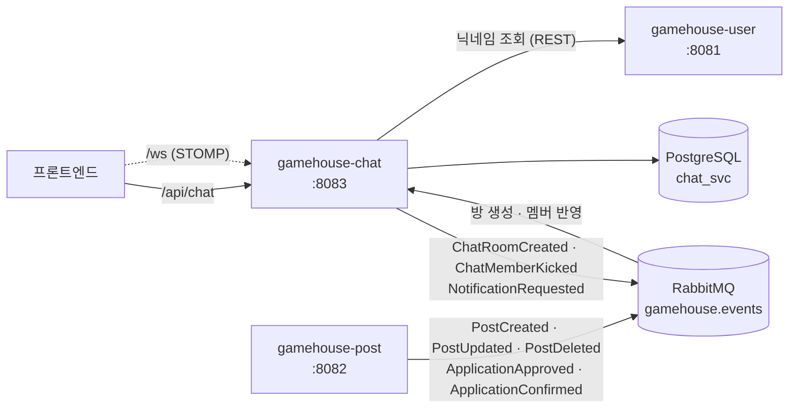

# gamehouse-chat

GameHouse의 **채팅** 서비스. 모집글과 지원 이벤트에 맞춰 채팅방을 자동으로 만들고,
실시간 메시지를 주고받으며, 파티에서 빠진 사람을 방에서 내보낸다.

---

## 1. 좌표

GameHouse는 서비스별로 레포가 분리된 MSA다. 이 레포는 그중 `chat` 하나다.

| 서비스 | 포트 | 담당 |
|---|---|---|
| `gamehouse-user` | 8081 | 회원·인증·친구·알림 |
| `gamehouse-post` | 8082 | 모집글·파티 |
| **`gamehouse-chat`** | **8083** | **1:1 · 파티 채팅** |
| `gamehouse-riot` | 8084 | Riot API 연동 |
| `gamehouse-match` | 8085 | AI Team Fit 추천 |
| `gamehouse-crew` | 8086 | 하우스(크루) |

공통 코드(JWT 검증, 전역 예외 처리, 이벤트 계약)는 `gamehouse-common`을
GitHub Packages에서 받아 쓴다. 배포 매니페스트는 `infra` 레포에 있다.

---

## 2. 서비스 관계도

**채팅방은 사용자가 직접 만들지 않는다.** 모집글이 생기고 지원이 승인되면 post가 이벤트를
보내고, chat이 그걸 받아 방을 만들거나 멤버를 넣는다. 글이 지워지면 방도 정리된다.
반대로 방이 만들어졌다는 사실과 누가 나갔다는 사실은 다시 이벤트로 post에 알려준다.

실시간 메시지는 STOMP over RabbitMQ로 오간다.

---

## 3. 담당 도메인

| 도메인 | 하는 일 |
|---|---|
| **채팅방** | 목록 · 상세 조회 |
| **메시지** | 히스토리 조회 · 실시간 송수신 (STOMP) |
| **자동 생성** | 모집글·지원 이벤트를 받아 방을 만들고 없앤다 |
| **멤버 관리** | 파티에서 빠진 사람을 방에서 내보내기 |
